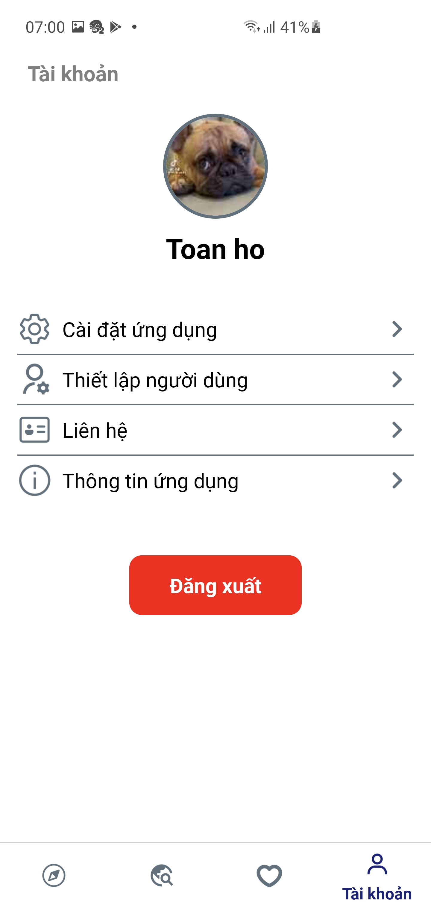
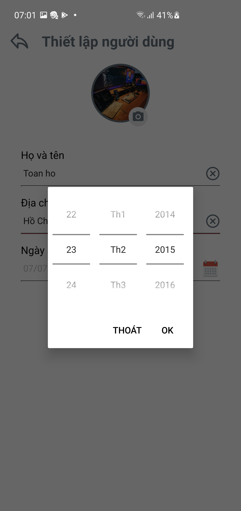

# Đự án demo
## _Khóa học trực tuyến_

>Dự án còn đang làm dở dang, sẽ update và hoàn thiện trong thời gian tới

FontEnd: React native
BackEnd: nodejs, mySql

## Các tính năng chính

- Thay đổi ngôn ngữ.
- Chế độ giao diện ban ngày và ban đêm.
- Đăng nhập, đăng xuất, đăng ký với mail.
- Show danh sách khóa học.
- Lưu lại phiên đăng nhập.
- Theo dõi khóa học, danh mục khóa học
- Tìm kiếm khóa học, tìm kiếm bằng giọng nói
- Thêm khóa học vào mục yêu thích để theo dõi
- Xem video chi tiết khóa học được theo dõi

Video giới thiệu: [YoutubeLinks](https://nodejs.org/)
Tải file apk: [GoogleDrive](https://drive.google.com/file/d/1p9ta8c_Mjk7qjY0ELA9rCN7gLolm8v3y/view?usp=sharing)


```sh
clone ProjectX-A3175
cd ProjectX-A3175
yarn
yarn start
yarn android
```
# Ảnh chụp màn hình

<p align="center">
  
  
  
</p>
<p align="center">
  
  
  
</p>
<p align="center">
  
  
  
</p>
<p align="center">
  
  
  
</p>


